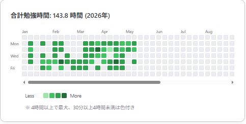

# Astro Habit Calendar 📅

Google カレンダーの予定から学習時間や習慣のログを自動集計し、GitHubのコントリビューション風（草）に表示する Astro コンポーネントです。



[実際の表示例(https://mathdoc.ifdef.jp/about/0003_about/)](https://mathdoc.ifdef.jp/about/0003_about/)

## 特徴

- ⚡ **爆速表示**: ビルド時に Google API からデータを取得し、静的なHTMLとして出力します（SSG）。
- 🔒 **セキュア**: APIキーはサーバーサイド（ビルド時）でのみ使用され、クライアント側には公開されません。
- 🌓 **ダークモード対応**: OS設定や `data-theme="dark"` に自動で対応します。
- 📱 **レスポンシブ**: 横スクロールに対応し、スマホでも閲覧可能です。

## 導入方法

### 1. ファイルの配置

`src/components/HabitCalendar.astro` と `src/utils/googleCalendar.ts` をあなたのプロジェクトにコピーします。

### 2. Google API の準備

このコンポーネントを使用するには、Google カレンダーのデータを取得するための設定が必要です。

1. **Google Cloud Console**:
   - プロジェクトを作成し、「Google Calendar API」を有効化します。
   - 「認証情報」から **APIキー** を作成します。
2. **Google カレンダー**:
   - 表示したいカレンダーの「設定と共有」を開きます。
   - 「予定のアクセス権」で **「一般公開して誰でも利用できるようにする」** にチェックを入れます。
   - 「カレンダーの統合」セクションにある **カレンダー ID** をコピーします。

### 3. 環境変数の設定

プロジェクトのルートにある `.env` ファイルに取得した値を設定します。

> [!CAUTION]
> APIキーを含む `.env` ファイルは絶対に GitHub にプッシュしないでください。`.gitignore` に `.env` を追加することを強く推奨します。

```properties
# サーバーサイド用（ビルド時に使用）
GOOGLE_CALENDAR_API_KEY="あなたのAPIキー"

# 公開用（カレンダーID）
PUBLIC_GOOGLE_CALENDAR_ID="あなたのカレンダーID"
```

### 4. コンポーネントの使用

MDX や Astro ファイルで以下のように呼び出します。

```astro
---
import HabitCalendar from './components/HabitCalendar.astro';
---

<HabitCalendar year={2026} />
```

## プロパティ

| Prop | Type | Default | Description |
| :--- | :--- | :--- | :--- |
| `year` | `number` | `currentYear` | 表示したい年 |
| `apiKey` | `string` | `process.env...` | Google APIキー（環境変数推奨） |
| `calendarId` | `string` | `process.env...` | GoogleカレンダーID |
| `label` | `string` | `"合計時間"` | ヘッダーに表示するラベル |

## 自動更新の設定 (GitHub Actions)

Google カレンダーの更新を反映させるにはサイトの再ビルドが必要です。GitHub Actions を使うと、毎日決まった時間に自動でビルド・デプロイを行うことができます。

### 1. GitHub Secrets の設定

リポジトリの **Settings > Secrets and variables > Actions** から、以下の2つのシークレットを登録してください。

- `GOOGLE_CALENDAR_API_KEY`: 作成した Google APIキー
- `PUBLIC_GOOGLE_CALENDAR_ID`: カレンダーID

### 2. ワークフローファイルの作成

`.github/workflows/deploy.yml`（ファイル名は任意）を作成し、以下の内容を記述します。

```yaml
name: Daily Deploy
on:
  schedule:
    - cron: '0 15 * * *' # 日本時間 0:00 (UTC 15:00)
  workflow_dispatch: # 手動実行ボタンを有効化

jobs:
  build:
    runs-on: ubuntu-latest
    steps:
      - uses: actions/checkout@v4
      - uses: actions/setup-node@v4
        with:
          node-version: 20
          cache: 'npm'
      - run: npm install
      - run: npm run build
        env:
          GOOGLE_CALENDAR_API_KEY: ${{ secrets.GOOGLE_CALENDAR_API_KEY }}
          PUBLIC_GOOGLE_CALENDAR_ID: ${{ secrets.PUBLIC_GOOGLE_CALENDAR_ID }}
      
      # ここにデプロイ（GitHub Pages, Vercel, Cloudflare Pages 等）のステップを追加
```

## ライセンス

MIT License
